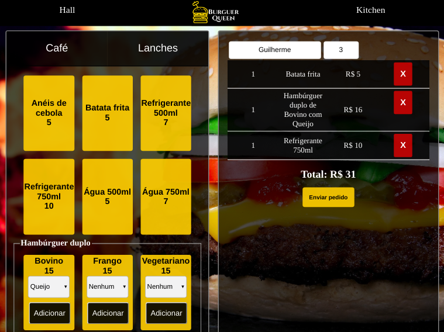
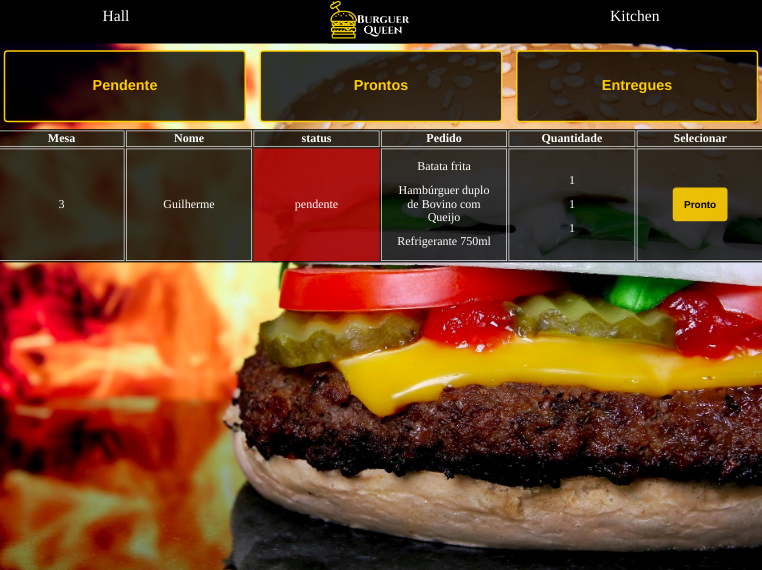

# Burger Queen

## Índice

* [1. Burger Queen](#1-Burger-Queen)
* [2. Resumo do projeto](#2-resumo-do-projeto)
* [3. Tecnologias](#3-Tecnologias)

***

## 1. Burger Queen

Aplicação Single Page App desenvolvida para um restaurante, onde o atendente pode anotar os pedidos através de um tablet no salão, e enviá-los para a cozinha para que sejam preparados.

## 2. Resumo do projeto

A interface do salão deverá mostrar para o atendente um menu dividido em duas partes a primeira com café da manhã e a segunda com os lanches. O usuário poderá adicionar e remover os produtos do pedido antes de ser enviados para a cozinha e a interface deve mostrar o resumo do pedido com o custo total.
A Cozinha receberá o pedido do salão com o status pendente para ser preparado. Após o preparo o cozinheiro modificará o status para pronto e o atendente poderá entregar e modificar o status para entregue, onde terá o histórico de todos os pedidos entregues com o tempo de preparo.

## 3. Tecnologias

    • HTML5
    • JavasScript (ES6)
    • React Hooks
    • Firebase
    • Aphrodite (CSS
    • Trello
    • Sweetalert2